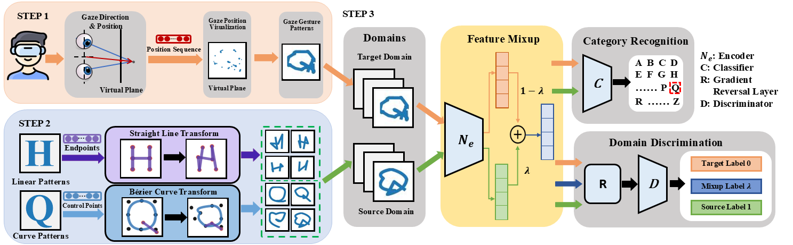

# Gaze Pattern Genius: Gaze-Driven VR Interaction using Domain Adaption



**Abstract:**

In this study, we propose a novel VR paradigm shift towards gaze-driven interaction based on gaze gesture, which offers unique advantages when hands or vocal communication are unavailable. We focus our study on improving the recognition accuracy of neural networks, especially when confronted with the challenge of limited user-specific gaze data. Recognizing the inherent challenges posed by the limited genuine user data for training, we delineate a novel framework for capturing gaze gesture patterns and introduce the concept of a template dataset to enhance neural training. The core of our proposal is a domain adaption model based on Generative Adversarial Networks (GANs). This model fuses the depth of the template dataset with the authenticity of sparse user data, consistently demonstrating an unparalleled adeptness in recognizing gaze gesture patterns across varied user demographics. Our methodology consistently outperforms against leading-edge recognition architectures. To cement the efficacy of our approach, we curate specific VR scenarios and interaction challenges. Empirical results from user studies indicate that gaze-driven interactions not only amplify the VR experience but also herald a new frontier in immersive VR control and interaction dynamics.

## Dataset

The dataset for model training can be downloaded [here](https://drive.google.com/drive/folders/1erGzSPGoFjNOTLkMNK6cB2cgk4agVf_I?usp=sharing). 

Place the dataset the directory specified by `--dataset_root`.

After downloading, the dataset should be organized like this

```
datasets
│  
│──gaze26_20_5
│   │
│   └───trainset
│   └───testset
│    
│──gaze26ForTest
│   │
│   └───trainset
│   └───testset
│
│──template
│   │
│   └───trainset
│   └───testset
└
```

## Requirements

## Train

```Bash

```

